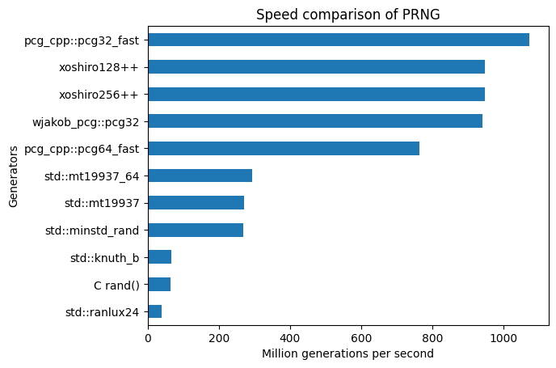

= Speed comparison & benchmark of differents C++ random number generators (PRNG)
ifdef::env-github[]
:warning-caption: :warning:
endif::[]

This repository provides an easy way to compare some common pseudo random number generators (PRNGS) used in C++. It also provides my results running the benchmarks for those wanting a quick answer. To reproduce my results and test for yourself, see section <<Test for yourself>>.

WARNING: Most of these algorithms should not be used in a context where security is required.

== Results

All these results were compiled over 100 hundred runs (`--benchmark_repetitions=100`) using an Intel i5-3570 @ 3.40GHz..... The binary was compiled with clang using -O3 -DNDEBUG, without any architecture optimization. The code is written to avoid any clever trick from the compiler that could bias the results.

.Table of results
|===
| PRNG (link) | Mean time per generation (user) | Mean generation per second | Remarks
| https://github.com/david-cortes/xoshiro_cpp[xoshiro128++] | 1.06ns ± 0.002 ns | 946.757M/s ± 0.719M/s |
| **https://github.com/david-cortes/xoshiro_cpp[xoshiro256++]** | **1.06ns ± 0.002 ns** | **946.704M/s ± 0.581M/s** | **Fastest for 64 bits, good quality, 400 lines**
| https://github.com/imneme/pcg-cpp[pcg_cpp::pcg32] | 1.09ns ± 0.010ns | 916.834M/s ± 8.424M/s |
| **https://github.com/imneme/pcg-cpp[pcg_cpp::pcg32_fast]** | **0.933ns ± 0.006ns** | **1071.970M/s ± 6.220M/s** | **Fastest for 32 bits**
| https://github.com/imneme/pcg-cpp[pcg_cpp::pcg64_oneseq] | 1.09ns ± 0.010ns | 916.063M/s ± 8.155M/s |
| https://github.com/imneme/pcg-cpp[pcg_cpp::pcg64] | 1.98ns ± 0.013ns | 504.325M/s ± 3.121M/s |
| **https://github.com/imneme/pcg-cpp[pcg_cpp::pcg64_fast]** | **1.31ns ± 0.012ns** | **763.500M/s ± 6.629M/s** |
| https://github.com/imneme/pcg-cpp[pcg_cpp::pcg64_oneseq] | 1.98ns ± 0.008ns | 504.750M/s ± 2.064M/s |
| https://github.com/wjakob/pcg32[wjakob pcg32] | 1.06ns ± 0.012ns | 940.393M/s ± 10.598M/s | Not that much faster than pcg-cpp
| **https://github.com/wjakob/pcg32[wjakob pcg32_8]** | **8.48ns ± 0.112ns** | **944.200M/s ± 12.215M/s** | **Fastest if your CPU have AVX**, mine does not
| https://burtleburtle.net/bob/rand/smallprng.html[burtle burtle C random] | 2.79ns ± 0.023ns | 358.876M/s ± 2.627M/s | 20 lines implementation
| https://en.cppreference.com/w/cpp/numeric/random/rand[C rand()] | 15.4ns ± 0.123ns | 65.005M/s ± 0.509M/s | Slow and poor quality, avoid
| **https://en.cppreference.com/w/cpp/numeric/random/mersenne_twister_engine[C++ STL std::mt19937 (MT)]** | **3.70ns ± 0.048ns** | **270.652M ± 3.418M/s** | **Best STL generator for portability**
| **https://en.cppreference.com/w/cpp/numeric/random/mersenne_twister_engine[C++ STL std::mt19937_64 (MT)]** | **3.40ns ± 0.028ns** | **294.261M ± 2.352M/s** | **Best STL generator for x86_64**
| https://en.cppreference.com/w/cpp/numeric/random/linear_congruential_engine[C++ STL std::minstd_rand (LCG)] | 3.72ns ± 0.038ns | 269.078M ± 2.705M/s | Worse quality than mt19937 and slower
| https://en.cppreference.com/w/cpp/numeric/random/linear_congruential_engine[C++ STL std::minstd_rand0 (LCG)] | 3.72ns ± 0.033ns | 268.768M ± 2.336M/s | Worse quality than mt19937 and slower
| https://en.cppreference.com/w/cpp/numeric/random/subtract_with_carry_engine[C++ STL std::ranlux24_base (SWC)] | 3.27ns ± 0.022ns | 306.088M ± 2.013M/s | Poor quality
| https://en.cppreference.com/w/cpp/numeric/random/subtract_with_carry_engine[C++ STL std::ranlux48_base (SWC)] | 3.28ns ± 0.038ns | 305.131M ± 3.484/s | Poor quality
| https://en.cppreference.com/w/cpp/numeric/random/discard_block_engine[C++ STL std::ranlux24 (DBE)] | 25.8ns ± 0.243ns | 38.809M ± 0.356M/s | Awfully slow
| https://en.cppreference.com/w/cpp/numeric/random/discard_block_engine[ C++ STL std::ranlux48 (DBE)] | 98.3ns ± 0.926ns | 10.18M ± 0.093M/s | Awfully slow
| https://en.cppreference.com/w/cpp/numeric/random/shuffle_order_engine[C++ STL std::knuth_b (SOE)] | 14.9ns ± 0.153ns | 66.990M ± 0.660M/s | Better quality than minstd_rand but as slow as rand
|===



=== Conclusion

`std::mt19937` and `std::mt19937_64` are the best standard C++ pseudo random number generators in the STL. However, https://www.pcg-random.org/[PCG] is superior in all aspects **for non-cryptographic** uses. https://prng.di.unimi.it/[xoshiro256++] is another very good choice for generating 64 bits random numbers, but it does not support multiple streams like PCG.

`rand()` need to be avoided at all costs, it is very slow and its quality is bad.


== Test for yourself

CMake will automatically download all dependencies from other repositories. You just need to have CMake and C++ compiler installed.

1. Clone this repository using git
+
```bash
git clone https://github.com/zeFresk/cpp-random-benchmarks.git
```
2. Compile using CMake :
+
```bash
cmake .
cmake --build .
```
3. Run and publish your results
+
```bash
./random_benchmarks
```
